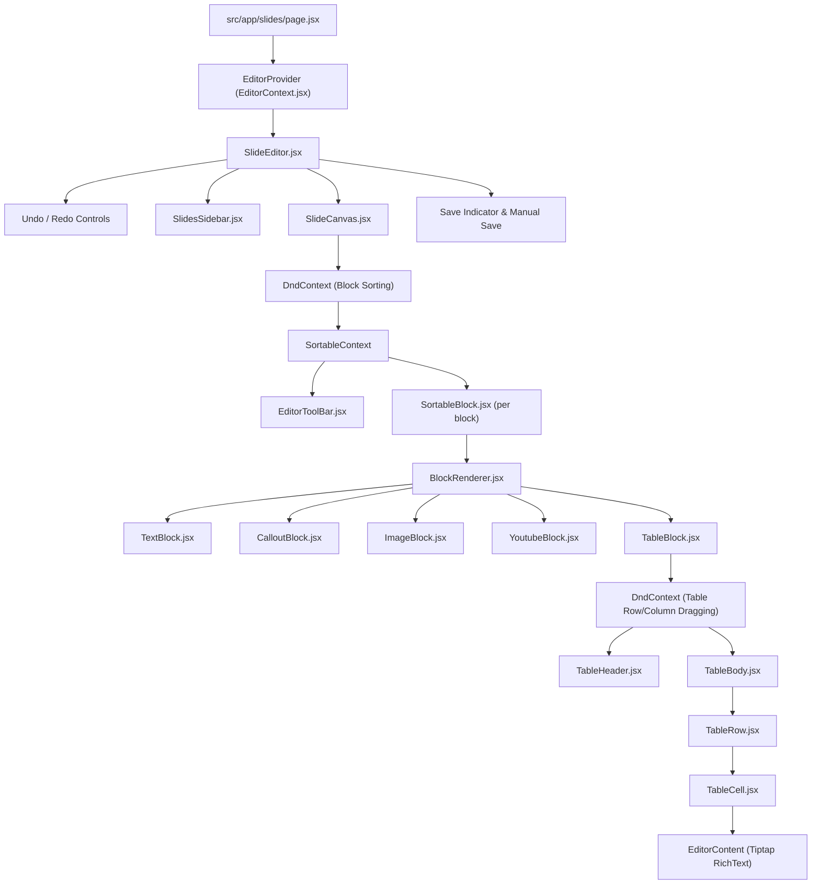
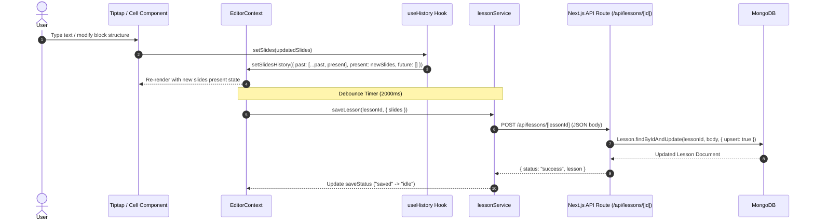

# System Architecture: Slide Editor

## 1. High-Level Technology Stack

* **Framework**: Next.js 16 (App Router, ES Modules)
* **UI Library**: React 19 (Client Components)
* **Rich Text Engine**: Tiptap v3 (`@tiptap/react`, `@tiptap/starter-kit`, `@tiptap/extension-underline`, `@tiptap/extension-highlight`)
* **Drag and Drop**: `@dnd-kit/core` & `@dnd-kit/sortable`
* **Icons**: `lucide-react`
* **Database & ORM**: MongoDB via Mongoose 9
* **Styling**: Vanilla Javascript for now, but later move to CSS Modules

---

## 2. Directory Structure Map

```text
d:\PROJECTS\SLIDE_EDITOR\
├── neverforgetnotes.md          # Developer checklist & pending task log
├── notes.md                     # Notes for features to be implemented
├── next.config.mjs              # Next.js configuration
├── package.json                 # Dependency definitions & scripts
└── src/
    ├── lib/
    │   ├── mongodb.js           # Mongoose DB connection handler with caching
    │   └── seedLessons.js       # Database seeding helper
    ├── models/
    │   └── Lesson.js            # Mongoose schemas (Block, Slide, Lesson)
    ├── services/
    │   └── lessonService.js     # Client API abstraction for GET/POST lesson routes
    └── app/
        ├── api/
        │   └── lessons/
        │       └── [lessonId]/
        │           └── route.js # Next.js API Route Handlers (GET, POST upsert)
        ├── page.js              # Landing page (Next.js default template for now)
        └── slides/
            ├── page.jsx         # Entry point for slide editor with EditorProvider
            ├── components/
            │   ├── EditorContext.jsx       # Central state provider & context hook
            │   ├── SlideEditor.jsx         # Main editor layout & save orchestrator
            │   ├── SlidesSidebar.jsx       # Slide thumbnail navigation & CRUD
            │   ├── SlideCanvas.jsx         # Main canvas container & block dnd provider
            │   ├── EditorToolBar.jsx       # Text formatting controls (Bold, Italic, etc.)
            │   ├── InsertMenu.jsx          # Block insertion dropdown menu
            │   ├── InsertMenuBetween.jsx   # Between-block add buttons
            │   ├── BlockActions.jsx        # Block context menu (Delete, Duplicate, Copy)
            │   ├── SortableBlock.jsx       # dnd-kit wrapper for slide blocks
            │   └── blocks/
            │       ├── BlockRenderer.jsx   # Block type dispatcher component
            │       ├── TextBlock.jsx       # Rich text block component
            │       ├── CalloutBlock.jsx    # Alert/callout block component
            │       ├── ImageBlock.jsx      # Image display & URL configuration
            │       ├── YoutubeBlock.jsx    # YouTube video embed player
            │       ├── DividerBlock.jsx    # Horizontal separator
            │       ├── QuizBlock.jsx       # Interactive quiz block placeholder
            │       └── Table/
            │           ├── TableBlock.jsx      # Main table block wrapper & DnD context
            │           ├── TableHeader.jsx     # Column drag handle header row
            │           ├── TableBody.jsx       # Table body rows renderer
            │           ├── TableRow.jsx        # Table row wrapper with row handle
            │           ├── TableCell.jsx       # Individual cell hosting Tiptap editor
            │           ├── TableActionMenu.jsx # Row/Column context options menu
            │           └── table.css           # Table styling, handles, & borders
            ├── hooks/
            │   ├── useEditorContext.jsx    # Context consumer hook
            │   ├── useSlides.js            # Slide/Block manipulation logic
            │   ├── useHistory.js           # History stack management (undo/redo)
            │   ├── useClipboard.js         # Block copying, pasting, & duplication
            │   ├── useTable.js             # Table structure, resizing, & drag hooks
            │   ├── useRichTextEditor.js    # Tiptap instance initialization & events
            │   ├── useSelection.jsx        # Multi-block selection handlers
            │   ├── useSlashMenu.js         # Slash command trigger & execution
            │   └── dnd/
            │       └── useEditorSortable.js # Utility hook for dnd-kit sortable items
            └── utils/
                ├── generateId.js           # Random unique string generator
                └── cloneBlock.js           # Deep clone utility for blocks
```

---

## 3. Data Schema & Domain Models

### Lesson Document Schema (`src/models/Lesson.js`)

```javascript
BlockSchema = {
  id: String,
  type: String, // 'text' | 'table' | 'image' | 'youtube' | 'callout' | 'divider' | 'quiz'
  content: Schema.Types.Mixed,
  important: Boolean
}

SlideSchema = {
  id: String,
  title: { type: String, default: "Untitled Slide" },
  blocks: [BlockSchema]
}

LessonSchema = {
  title: { type: String, default: "Untitled Lesson" },
  slides: [SlideSchema],
  timestamps: true // createdAt, updatedAt
}
```

---

## 4. Component Hierarchy & Rendering Pipeline



---

## 5. State Architecture & Control Flow



### State Containers Breakdown

1. **`slidesHistory` State (`EditorContext`)**:
   * `{ past: Array, present: Array, future: Array }`.
   * Pushes up to 50 previous states on discrete operations.
   * `undo` pops from `past` to `present` and pushes to `future`.
   * `redo` shifts from `future` to `present` and pushes to `past`.

2. **Tiptap Instance Registry (`cellEditors`)**:
   * Held via `useRef` inside `EditorContext`.
   * Keyed by `cellId`. Enables programmatically focusing specific cell editors (`focusEditor(cellId)`) during keyboard navigation (ArrowUp, ArrowDown, Tab).

3. **Table Interactive State (`tableSelection`, `tableResizeState`, `tableMenu`)**:
   * `tableSelection`: Identifies selected block, selection type (`row`, `column`, `cell`), and indices.
   * `tableResizeState`: Tracks mouse drag coordinates (`startX`, `startY`) and initial dimensions (`initialWidth`, `initialHeight`) for live cell resizing.
   * `tableMenu`: Controls positioning and anchor metadata for the table contextual action menu (`TableActionMenu.jsx`).

---

## 6. Persistence & Data Integration

* **Client Service (`src/services/lessonService.js`)**: Encapsulates fetch HTTP calls to `/api/lessons/${lessonId}` for `getLesson` (GET) and `saveLesson` (POST).
* **API Route (`src/app/api/lessons/[lessonId]/route.js`)**: Executes `connectDB()`, updates or creates lesson documents via `Lesson.findByIdAndUpdate(lessonId, body, { returnDocument: "after", upsert: true })`.
* **Database Connection (`src/lib/mongodb.js`)**: Maintains connection readiness check (`mongoose.connection.readyState`) to prevent re-opening connections during serverless hot-reloads.
